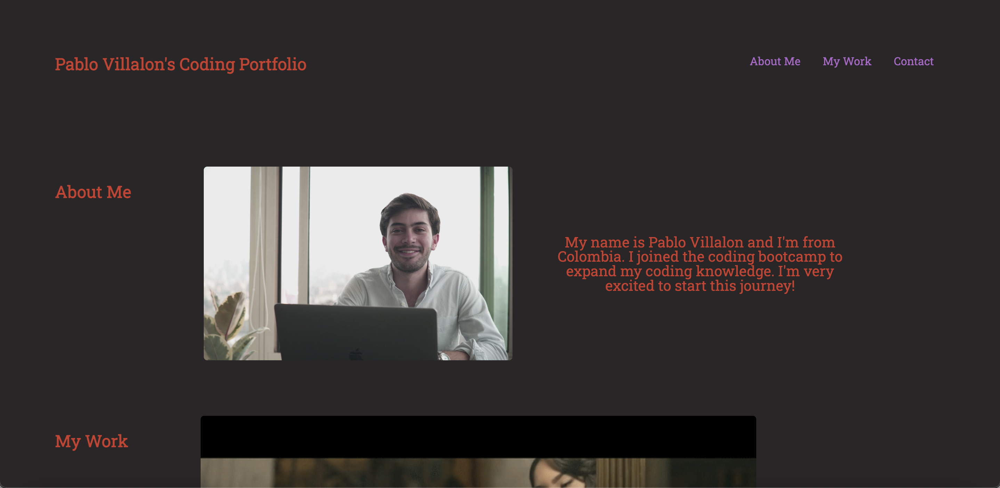

# <CODING BOOTCAMP: CHALLENGE #2>

## Description

The intention of this web development project is to make a portfolio site that displays my work and gives a basic framework of structure and design that is versatile, responsive and relevant to the content of the site. 

My project was deployed to the following website: https://pvlln.github.io/PabloVillalon-challenge-2/

Here you will find my finished project. 

## Installation

To get my project running, you simply need to access the deployed website. It is an informative site so there is not much more you need to do to access the complete functionality of the site. This website works best using Chromium-Based browsers. 

## Usage

To use this site, you only need to be able to access it. The code is very simple and easy to use by any user that can access it. 

## Credits

Credit to myself, 2023.

## License

This website is covered under the MIT copyright license. For more information, google it. 

## Badges

Nope, no badges. 

## Features

My project has two JavaScript functions. You may see them in action in the developer console. 

## How to Contribute

I am not accepting contributions to this site. 

## Tests

No tests for the application- pretty simple functionality. The site is informational, and all of its features have been tested on multiple different screens. 
